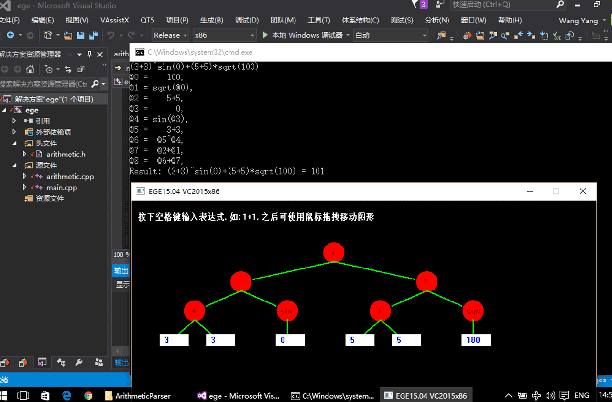
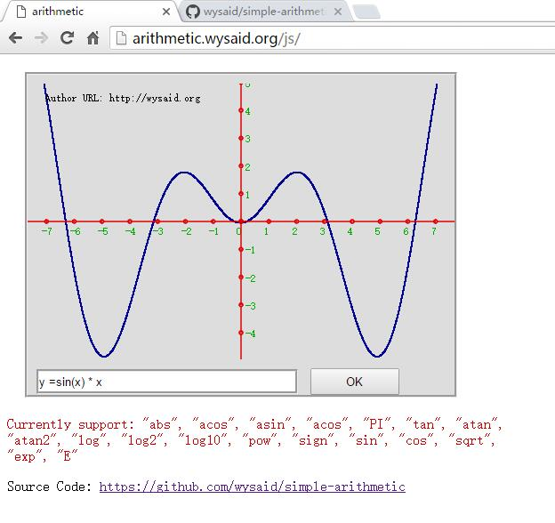

# simple-arithmetic

## c++ version

A tiny & high-performance calculation class without other dependencies.  
You can use it simply like:

```cpp
string s = "(1+1+1+1) ^ tan(((2+2)+(3-2)) * 0.5)";
ArithmeticExpression expression(s);
if(expression)
{
    printf("%s = %g\n", s.c_str(), expression.value());
}
```

or with variable `x` and `y`:

```cpp
string s = "cos(x^2) + sin(y)^2";
ArithmeticExpression expression(s);
if(expression)
{
    expression.setX(0.8);
    expression.setY(1.5);
    printf("%s = %g\n", s.c_str(), expression.value());
}
```

### How to use

Just add `arithmetic.cpp` & `arithmetic.h` to your project.

### ScreenShot



## javascript version

A simple demo that just draw the equation curve

View it online: [http://arithmetic.wysaid.org](http://arithmetic.wysaid.org "wysaid.org")

### ScreenShot Web

[](http://arithmetic.wysaid.org)
